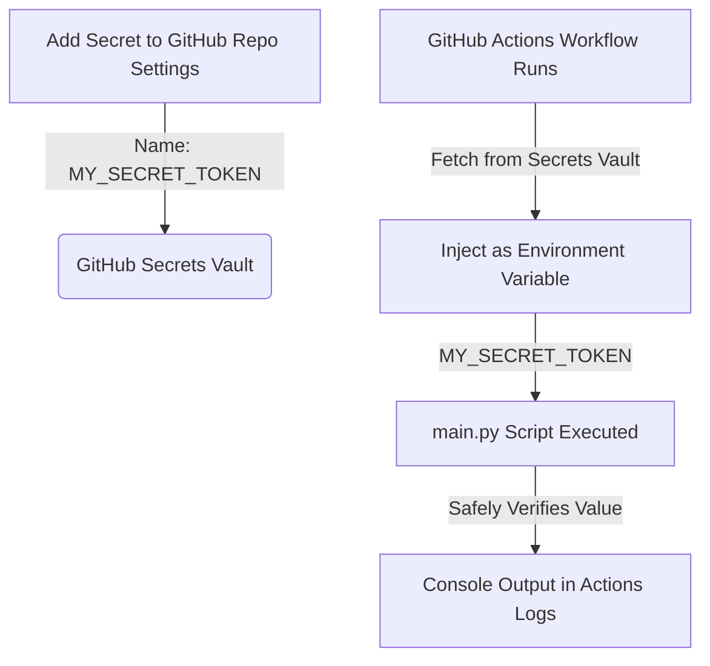

# GitHub Secrets Demo Project

This is a bare-minimum project illustrating how to store and access sensitive tokens or credentials securely using **GitHub Secrets** and **GitHub Actions**.
This is me Tanishq
---

## How It Works



1. You store your sensitive token in **GitHub Secrets** under the name `MY_SECRET_TOKEN`.
2. The GitHub Actions workflow ([demo.yml](.github/workflows/demo.yml)) is triggered (either by a code push or manually).
3. The workflow retrieves the secret securely and maps it to an environment variable (`MY_SECRET_TOKEN`).
4. The Python script ([main.py](main.py)) reads the environment variable and processes it safely (without leaking/printing it to the logs).

---

## Step-by-Step Guide

Follow these steps to set up and run this demonstration in your own repository:

### 1. Initialize Git and Push to GitHub
If you haven't already, initialize this directory as a git repository, commit the files, and push it to your GitHub repository:
```bash
git init
git add .
git commit -m "Initialize secrets demo project"
git branch -M main
git remote add origin https://github.com/YOUR_USERNAME/YOUR_REPO_NAME.git
git push -u origin main
```

### 2. Add the Secret to GitHub
To add the secret token to your repository:
1. Navigate to your repository on GitHub.
2. Click on the **Settings** tab.
3. In the left sidebar, expand the **Secrets and variables** section and select **Actions**.
4. Click the green **New repository secret** button.
5. Set the fields as follows:
   - **Name**: `MY_SECRET_TOKEN`
   - **Secret**: *Enter any secret value or token you want to protect (e.g., `SuperSecret123!`)*
6. Click **Add secret**.

> [!NOTE]
> Repository secrets are encrypted. Once saved, you (and anyone else) cannot read the secret's value through the GitHub UI anymore; it can only be updated or deleted.

### 3. Run the Demonstration
Because the workflow has `workflow_dispatch` enabled, you can run it manually:
1. Go to the **Actions** tab on your GitHub repository.
2. Select the **GitHub Secrets Demo Workflow** from the list on the left.
3. Click the **Run workflow** dropdown on the right, select the branch (e.g., `main`), and click the green **Run workflow** button.
4. Once the job runs, click on the workflow run to view the logs. You will see:
   - The Python script successfully detected the secret token.
   - The script outputted the length and a masked preview of the token to show it was successfully accessed.

---

## Files Included

| File | Description |
| :--- | :--- |
| [`main.py`](main.py) | Python script that reads `MY_SECRET_TOKEN` from environment variables and safely processes it. |
| [`.github/workflows/demo.yml`](.github/workflows/demo.yml) | GitHub Actions workflow configuration that runs the Python script and maps the secret. |
| [`README.md`](README.md) | Documentation explaining the usage and setup. |

> [!IMPORTANT]
> **Best Practice Alert**:
> Never print your raw secrets to logs (`print(secret_token)`). While GitHub Actions attempts to automatically mask secrets that appear in standard output, masking can fail under certain patterns. Always handle secrets with care inside your application code.
